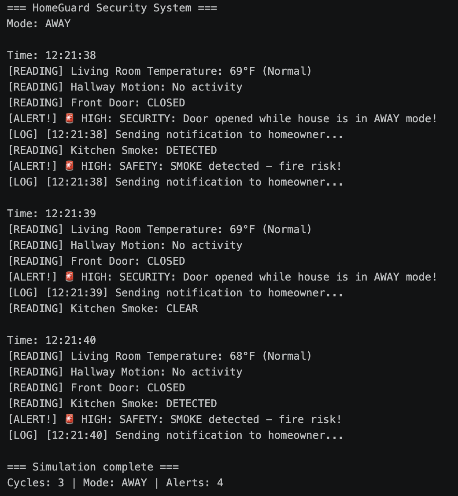
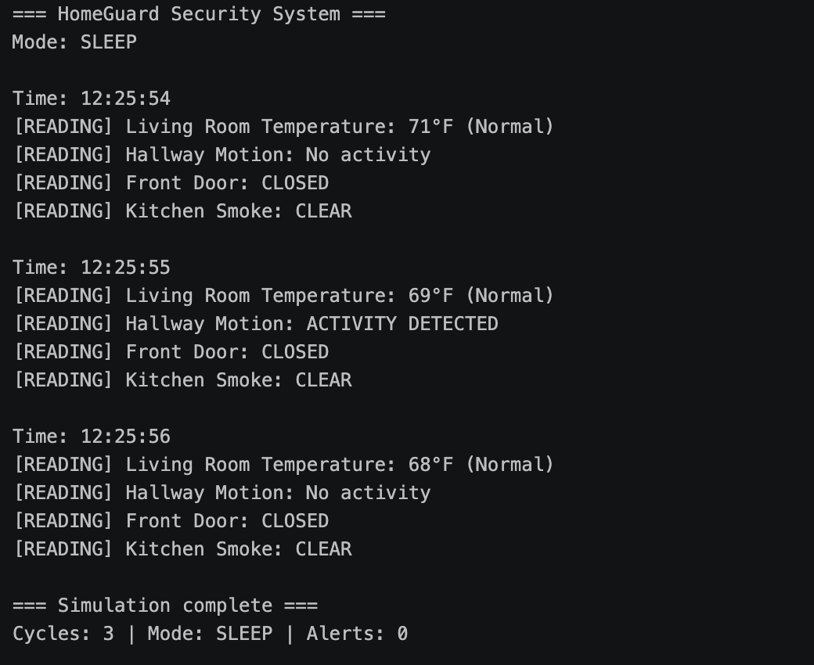

Screenshot of output - 
Test 1 - 
Test 2 - 

Brief explanation of what the program does - 
The program creates a list of Sensor objects, each built from a Sensor class that stores its own data (ID, location, type, current value) and has methods to read a new simulated value and check whether that value is abnormal. The main loop runs for a set number of cycles, and in each cycle every sensor generates a new random reading, which is displayed and then checked against thresholds (like temperature below 35°F) and the current system mode (HOME, AWAY, or SLEEP). If a reading is abnormal, the program triggers an alert and writes an event log so all activity can be reviewed later.